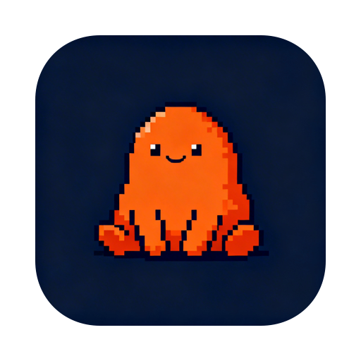

<p align="center">
  
</p>

<h1 align="center">ClaudeBar</h1>

<p align="center">
  macOS menu bar companion for <a href="https://docs.anthropic.com/en/docs/claude-code">Claude Code</a>.<br>
  Respond to permissions, questions, and prompts without switching to your terminal.
</p>

<p align="center">
  
  
  
</p>

---

## The Problem

Claude Code runs in the terminal. When it needs your input — permission to run a command, a question, idle prompt — you have to switch to the terminal, find the right window, and respond. This breaks your flow.

## How It Works

```
Claude Code (hook) → ClaudeBar (popup) → You (click Allow) → Terminal (receives "y" + Enter)
```

ClaudeBar listens for hook events via Unix socket. When Claude needs attention, a popup appears on your menu bar. Your response is sent directly to the correct terminal window.

## Features

- **Permission prompts** — Allow/Deny buttons with command preview
- **Questions** — Option buttons for AskUserQuestion events
- **Text input** — Free-form input field for general prompts
- **Window targeting** — Sends to the exact terminal window running Claude Code
- **Sound notifications** — Ping when Claude needs attention
- **Auto-popup** — Popup appears automatically on new events

### Terminal Support

| Terminal | Status | Method |
|----------|--------|--------|
| Kitty | Full support | `kitten @` remote control |
| iTerm2 | Basic | AppleScript |
| Terminal.app | Basic | AppleScript |
| WezTerm | Basic | `wezterm cli` |

Kitty is recommended for window ID targeting.

## Setup

### Requirements

- macOS 14 Sonoma or later
- Xcode 16+

### Build & Run

```bash
cd ClaudeBar
xcodebuild -scheme ClaudeBar -configuration Debug build
open ~/Library/Developer/Xcode/DerivedData/ClaudeBar-*/Build/Products/Debug/ClaudeBar.app
```

Or open `ClaudeBar.xcodeproj` in Xcode and hit Run.

### Install Hook

```bash
cp ClaudeBar/Hook/notify-claudebar.sh ~/.claude/hooks/notify-claudebar.sh
chmod +x ~/.claude/hooks/notify-claudebar.sh
```

Add to `~/.claude/settings.json`:

```json
{
  "hooks": {
    "Notification": [
      {
        "matcher": "",
        "hooks": [
          {
            "type": "command",
            "command": "~/.claude/hooks/notify-claudebar.sh"
          }
        ]
      }
    ]
  }
}
```

### Kitty Setup

Enable remote control in `kitty.conf`:

```
allow_remote_control yes
listen_on unix:/tmp/kitty-{kitty_pid}
```

Restart kitty after changing the config.

## Architecture

```
~/.claude/hooks/notify-claudebar.sh
  ↓ reads stdin JSON, injects KITTY_WINDOW_ID
/tmp/claudebar.sock
  ↓
SocketServer → EventParser → SessionManager
  ↓
PopoverView → PermissionView / QuestionView / InputView
  ↓
KittyAdapter → kitten @ send-text + send-key Return
```

## Roadmap

- [ ] Auto-dismiss popup after timeout
- [ ] Global keyboard shortcut to toggle popup
- [ ] Notification history
- [ ] Multiple concurrent sessions
- [ ] tmux adapter

## License

MIT
